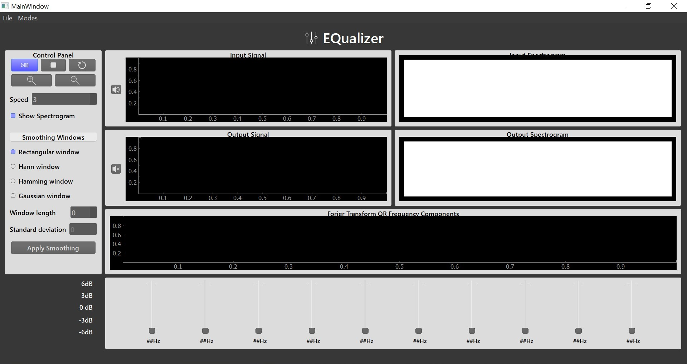
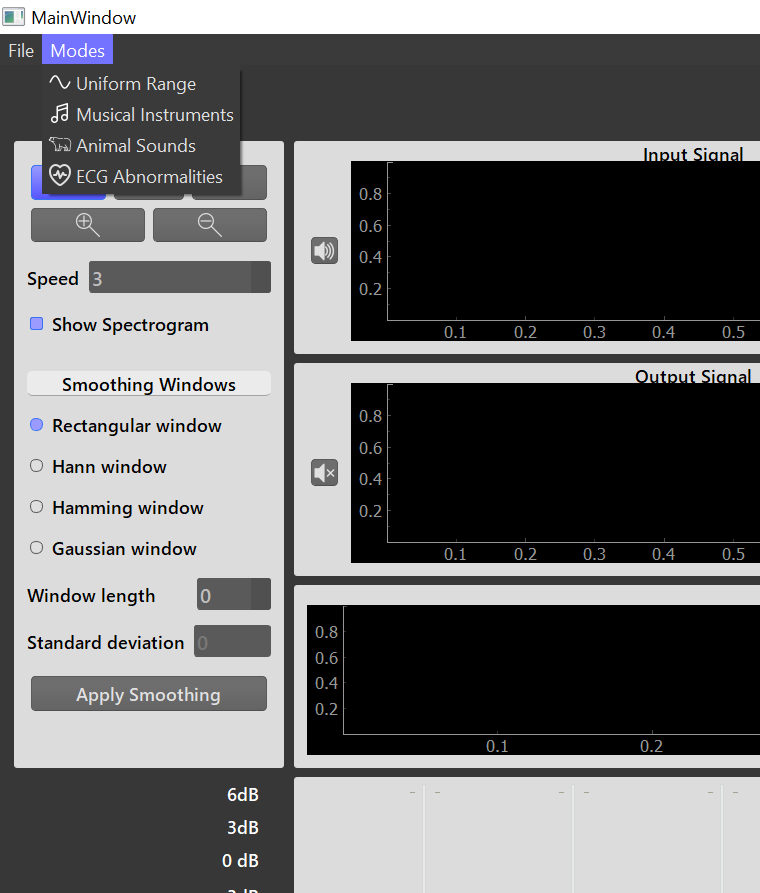
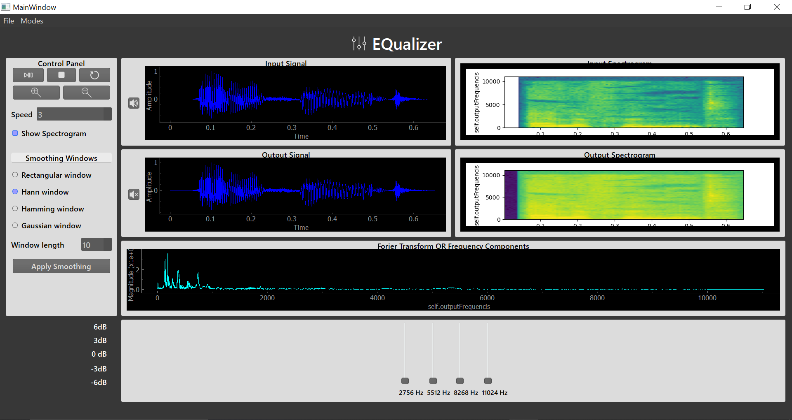

# Signal Equalizer Desktop Application

## Introduction
The Signal Equalizer Desktop Application is a tool designed for the music and speech industry, as well as biomedical applications like hearing aid abnormalities detection. This application allows users to open a signal, adjust the magnitude of specific frequency components through sliders, and reconstruct the modified signal. The tool operates in different modes, including Uniform Range Mode, Musical Instruments Mode, Animal Sounds Mode, and ECG Abnormalities Mode.

## Modes
1. **Uniform Range Mode:**
   - Divides the total frequency range of the input signal into 10 equal frequency ranges, each controlled by a slider.
   - Users can modify the magnitude of frequency components in a uniform manner across the entire spectrum.

2. **Musical Instruments Mode:**
   - Enables users to control the magnitude of specific musical instruments in a mixed music signal with at least four different instruments.

3. **Animal Sounds Mode:**
   - Allows users to control the magnitude of specific animal sounds in a mixture of at least four animal sounds.

4. **ECG Abnormalities Mode:**
   - Users can choose from four ECG signals, including one normal and three with specific arrhythmias.
   - Each slider controls the magnitude of the arrhythmia component in the input signal.

## Multiplication/Smoothing Windows
Users can choose from four multiplication/smoothing windows:
- Rectangle
- Hamming
- Hanning
- Gaussian

The chosen window is applied when multiplying the frequency range with the corresponding slider value. Users can visually customize the window parameters and apply them to the equalizer.

## User Interface
- **Sliders:**
  - The number and captions of sliders change based on the selected mode.
  
- **Signal Viewers:**
  - Two linked cine signal viewers for the input and output signals.
  - Functionality panel includes play, stop, pause, speed control, zoom, pan, and reset options.
  - Linked viewers ensure synchronous display of the signals, showing the same time-part if the user scrolls or zooms.

- **Spectrograms:**
  - Two spectrograms for the input and output signals.
  - Spectrograms dynamically reflect changes made using the equalizer sliders.
  - Option to toggle show/hide of the spectrograms.

  
  
  
  

## Usage
1. Open the application.
2. Choose a mode from the options menu.
3. Load a signal.
4. Choose a multiplication/smoothing window.
5. Adjust sliders to modify frequency magnitudes.
6. Visualization of window customization is showed.
7. Use the signal viewers and spectrograms to analyze the modified signal.
